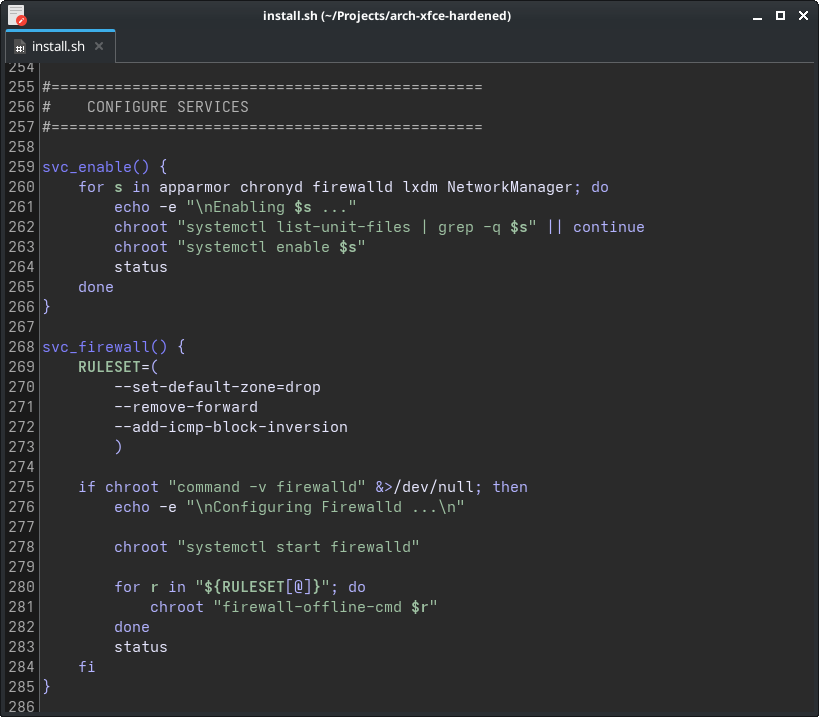

## Chameleon Color Scheme

It’s named Chameleon because its background color automatically adapts to your desktop theme.
The text and syntax highlighting use a beautiful blue-green palette inspired by the chameleon
itself. Chameleons are cool—and so is this color schema designed for GtkSourceView-based text
editors.

Compatable with Gedit, Pluma, Xed, GNOME Text Editor, etc.

Copy the [chameleon.xml](https://github.com/kuladog/gedit-color-scheme/blob/main/chameleon.xml)
file into a folder of the style search path.

**Typical search paths for GtkSourceView version 3.0:**

1. `~/.local/share/gtksourceview-3.0/styles/`
2. `/usr/share/gnome/gtksourceview-3.0/styles/`
3. `/usr/local/share/gtksourceview-3.0/styles/`
4. `/usr/share/gtksourceview-3.0/styles/`

**Typical search paths for GtkSourceView version 4:**

1. `~/.local/share/gtksourceview-4/styles/`
2. `/usr/share/gnome/gtksourceview-4/styles/`
3. `/usr/local/share/gtksourceview-4/styles/`
4. `/usr/share/gtksourceview-4/styles/`

Select 'Chameleon' from `Preferences -> Font's and Colors -> Themes`
